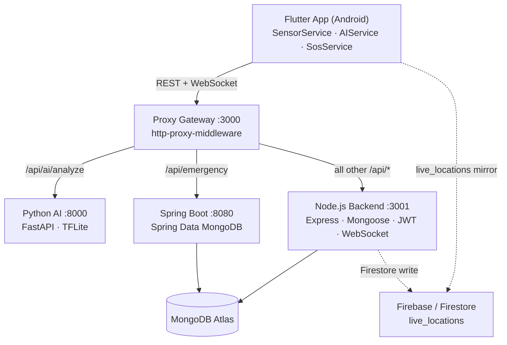

# SafePulse Architecture



## Service Responsibilities

| Service | Port | Technology | Responsibility |
|---|---|---|---|
| **Proxy Gateway** | 3000 | Node.js, http-proxy-middleware | Single public entry point; routes `/api/ai/analyze` → Python, `/api/emergency` → Spring Boot, everything else → Node backend |
| **Node.js Backend** | 3001 | Express, Mongoose, JWT, WebSocket | Auth, route scoring, realtime WebSocket hub, risk zone management |
| **Spring Boot Service** | 8080 | Java, Spring Boot 3, Spring Data MongoDB | Emergency event persistence, priority scoring, lifecycle management |
| **Python AI Service** | 8000 | Python, FastAPI, TFLite | TFLite crash analysis, heuristic fallback, phone-drop filtering, inference metrics |
| **MongoDB Atlas** | — | MongoDB | Primary data store for all services |
| **Firebase / Firestore** | — | Firebase Auth, FCM, Firestore | Auth, push notifications, supplementary live-location sync |

## Entry Point

**Port 3000 — Proxy Gateway** is the single public entry point for all mobile client traffic.  
Ports 3001, 8080, and 8000 are internal-only and must not be exposed directly in production.

| Public URL | Routed to |
|---|---|
| `/*` (default) | Node.js Backend :3001 |
| `/api/ai/analyze` | Python AI Service :8000 |
| `/api/emergency` | Spring Boot :8080 |
| `GET /health` | Gateway health (no upstream) |

## PM2 startup

```bash
pm2 start ecosystem.config.js --env production
```

This starts two processes:
- `safepulse-proxy-gateway` (port **3000**, fork mode) — the public entry point
- `safepulse-gateway` (port **3001**, cluster mode) — internal Node.js backend
