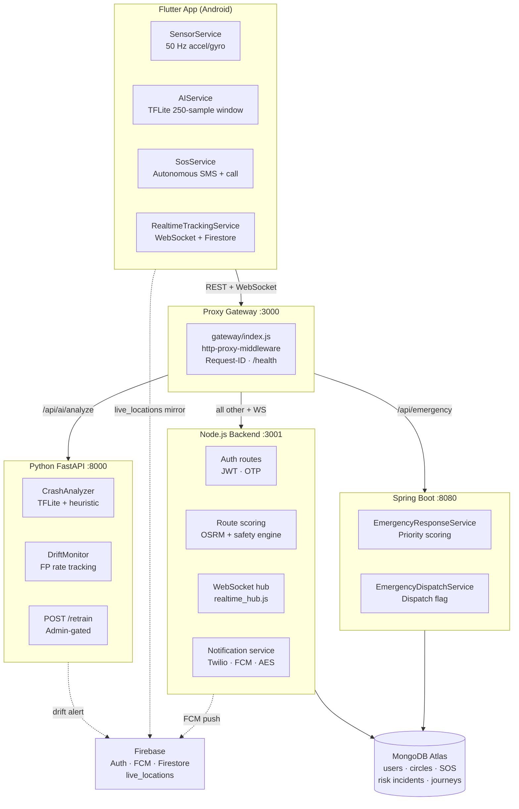

# SafePulse — System Architecture

## Service Diagram



## Entry Points Table

| Service | File | Port | Protocol | Health Endpoint |
|---------|------|------|----------|----------------|
| **Proxy Gateway** | `backend/gateway/index.js` | 3000 | HTTP/WS | `GET /health` |
| **Node.js Backend** | `backend/index.js` | 3001 | HTTP/WS | `GET /health` |
| **Spring Boot** | `BackendApplication.java` | 8080 | HTTP | `GET /actuator/health` |
| **Python AI** | `ai-service/app/main.py` | 8000 | HTTP | `GET /health` |

> **Ports 3001, 8080, 8000 are internal-only.** Only port 3000 (Proxy Gateway) should be exposed in production.

## Core Safety Data Flows

### Flow 1 — Real-time Journey Tracking (Gap #5)
```
App SensorService (50 Hz)
  → RealtimeTrackingService.sendTrackingUpdate()
  → WebSocket  wss://gateway:3000/ws/tracking
  → Gateway (WS proxy) → Node.js WS hub
  → safety_engine.js evaluateSafety()
  → If CRITICAL: broadcastToCircle() via FCM/WS
  → Simultaneously: Firestore live_locations mirror (supplementary)
```

### Flow 2 — On-Device Crash Detection (Gap #2)
```
AIService.addData() ← accelerometer/gyro at 50 Hz
  → sliding window [250 × 6]
  → if G-force > 4.5G: _runAIAnalysis()
    → TFLite interpreter.run([1,250,6])
    → if probability > 0.25: onCrashDetected()
  → Server fallback: POST /api/ai/analyze → Python CrashAnalyzer
```

### Flow 3 — Autonomous SOS (Gap #3)
```
SosService.triggerHybridSOS()
  ├─ Online: POST /api/sos/start → Node.js → MongoDB + circle notifications
  └─ Offline: _executeEmergencySOSLocal()
       → foreground service promotion (Completer, 3s timeout)
       → Telephony.sendSms() per contact
       → FlutterPhoneDirectCaller.callNumber(first contact)
       → On failure: LocalQueueService.enqueue() for retry
```

### Flow 4 — Safety-Scored Route Recommendations (Gap #4)
```
App POST /api/routes/suggest {start, destination}
  → Gateway → Node.js route_routes.js
  → OSRM routing API (3 alternatives)
  → safety_engine: risk zone intersection per route
  → TrafficWeatherService.getWeatherRisk() → Open-Meteo API
  → scoreRoutesWithWeather(): riskScore * (1 + severity/200)
  → Response: sorted routes with riskScore, label, riskDataAvailable
```

### Flow 5 — Emergency Dispatch (Gap #3 — Spring Boot)
```
App POST /api/emergency {latitude, longitude, severity}
  → Gateway → Spring Boot EmergencyResponseService
  → priorityScore() calculation (0–100)
  → EmergencyEvent.dispatchRecommended = score >= 80
  → MongoDB persist
  → EmergencyDispatchService.dispatchEmergency() [future: gov API]
```

## SOS Routing — Server-to-Server Clarification

The Flutter app and the API gateway interact with **two separate SOS endpoints** that serve different purposes:

| Path | Handler | Called by | Purpose |
|------|---------|-----------|---------|
| `POST /api/sos/start` | Node.js `routes/sos.js` | Flutter app (via gateway) | Primary SOS — persists to MongoDB, triggers FCM notifications, SMS fallback |
| `POST /api/sos` | Spring Boot `SosController` | Node.js backend (server-to-server) | Emergency event record for priority scoring and future government dispatch |

The gateway routes `/api/emergency/*` to Spring Boot and all other `/api/*` traffic (including `/api/sos/*`) to Node.js. **The mobile client never calls Spring Boot directly.** After the Node.js SOS handler completes its own processing, it calls the Spring Boot `POST /api/sos` internally via `emergency_event_client.js` to create a priority-scored `EmergencyEvent` record. This separation keeps the emergency dispatch layer (Spring Boot) decoupled from the real-time notification layer (Node.js).

## Firestore Security Model

Access to `live_locations` and `circles` is controlled by subcollection membership:

```
circles/{circleId}/members/{uid}  ← existence check
```

A user can only read a `live_locations` document if they are a member of the circle associated with the tracked user. See `firestore.rules` for the full ruleset.
